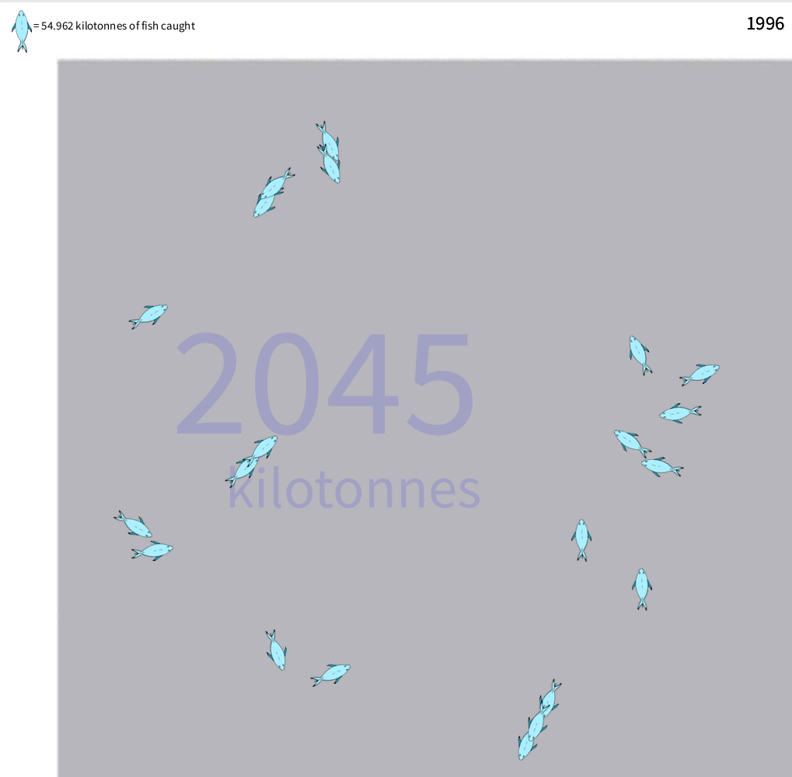

fishualization
==============
Created by: Erik Bonadonna, Benjamin Potts and Luna Zhang

A research project exploring the relationship between fish, data and money. Using [Processing](https://processing.org/), we developed a data visualization using data from
Icelandic fishing boats. We were inspired to attempt to re-embody fish from the data, and see what could be lost or gained from the process. 

Supported by Phoebe Sengers and Hrönn Brynjarsdóttir Holmer with [Culturally Embedded Computing](https://cemcom.infosci.cornell.edu) at Cornell University

### Functions: 
SPACEBAR: Swaps states from fish to krona or visa versa 
UP/DOWN: Changes the level of zoom on the fish (still in development) 
LEFT/RIGHT: Changes the year of data the simulation is based off 
A; Launches an experimental mode 
CLICK AND HOLD; Attracts the fish to the location of the mouse in the sim window

This program works by taking input in the form of a CSV file containing information on the catch and sale of fish from Icelandic fishing boats and converting it into a dynamic flock of fish whose frequency changes with proportion to the catch made each year. When Spacebar is pressed, these fish transform into Icelandic Krona with proportion to the amount of money extracted per pound of fish each year.

Fish and Krona are rendered by referencing .png files rather than more traditional PShapes. Fish and Krona are defined in the BOID CLASS with values of maximum speed and force These values are in turn controlled by a Sim Speed value in order to keep them in proportion. Additionally values such as separation and cohesion are defined giving boids a greater sense of agency and realism.

Information concerning the weight, price and year to which the program refers are rendered in the Draw loop Anything placed in this loop will be affected by anything placed above it in the loop and hold sway over anything below it.

### CITATIONS 
  The basis for this implementation comes from "Flocking" by Daniel Shiffman 
  an implentation of Craig Reynold's Boids program.fishualization

Created by: Erik Bonadonna, Benjamin Potts and Luna Zhang

A research project the relationship between fish, data and money. Using Processing, we developed a data visualization using data from Icelandic fishing boats. We were inspired to attempt to re-embody fish from the data, and see what could be lost or gained from the process.

Supported by Phoebe Sengers and Hrönn Brynjarsdóttir Holmer with Culturally Embedded Computing at Cornell University
Functions:

SPACEBAR: Swaps states from fish to krona or visa versa UP/DOWN: Changes the level of zoom on the fish ( Still in development) LEFT/RIGHT: Changes the year of data the simulation is based off A; Launches an experimental mode CLICK AND HOLD; Attracts the fish to the location of the mouse in the sim window

This program works by taking input in the form of a CSV file containing information on the catch and sale of fish from Icelandic fishing boats and converting it into a dynamic flock of fish whos frequency change with proportion to the catch made each year. When Spacebar is pressed, these fish transform into icelandic Krona with proportion the amount of money extracted per pound of fish each year.

Fish and Krona are rendered by referencing .png files rather than more tratdiotional PShapes. Fish and Krona are defined in the BOID CLASS with values of maximum speed and force These values are intern controlled by a Sim Speed value in order to keep them in proportion. Additionally values such as separation and cohesion are defined givng boids a greater sense of ajency and realism.

Information concering the weight, price and year to wich the progam reffers are rendered in the Draw loop Anything placed in this loop will be effected by anything placed above it in the loop and hold sway over anything below it.
CITATIONS

The basis for this implementation of comes from "Flocking" by Daniel Shiffman an implentation of Craig Reynold's Boids program. URL: https://code.google.com/p/processing/source/browse/trunk/processing/java/examples/Topics/Simulate/Flocking/Flocking.pde?r=9025

Assistance on the attraction of boids to a clicked mouse came from "TfGuy44" on the processing formus URL: http://forum.processing.org/two/discussion/2366/flocking-with-ai-for-2d-games/p1

Fishing Datasets sourced from Statistics Iceland URL:http://www.statice.is
  URL:  https://code.google.com/p/processing/source/browse/trunk/processing/java/examples/Topics/Simulate/Flocking/Flocking.pde?r=9025
  
  Assistance on the attraction of boids to a clicked mouse came from "TfGuy44" on the processing forums
  URL:  http://forum.processing.org/two/discussion/2366/flocking-with-ai-for-2d-games/p1
  
  Fishing Datasets sourced from Statistics Iceland
  URL:http://www.statice.is

